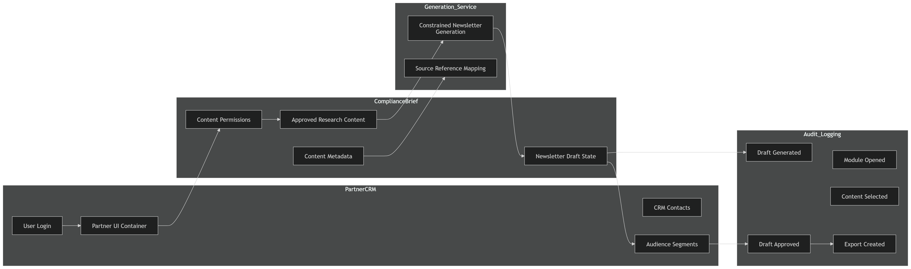

# PM Case Study Framework

## From Interview Failure to Product Operating System

This repository documents how I turned a weak moment in a Product Manager interview into a structured learning project.

The goal was not to pretend that one project creates seniority overnight.

The goal was to understand the gap, rebuild the thinking process properly, and create a reusable Product Manager framework for transforming ambiguous business requests into engineering-ready work.

---

## Core Thesis

A Product Manager should not pass ambiguity directly to engineering.

A Product Manager should turn ambiguity into:

- business goals;
- actors;
- systems;
- user journeys;
- product decisions;
- use cases;
- engineering tickets;
- acceptance criteria;
- risks;
- validation plans.

The PM does not need to know every answer immediately.

But the PM must know how to structure uncertainty.

---

## Applied Case Study

### ComplianceBrief x PartnerCRM — Newsletter Partnership Integration

This repository uses a fictional B2B partnership scenario.

ComplianceBrief produces weekly compliance research content.

PartnerCRM is a larger CRM platform used by sales and customer-success teams.

The business request:

Integrate ComplianceBrief's newsletter product with PartnerCRM so PartnerCRM users can create newsletters using ComplianceBrief content.

The project demonstrates how to move from that ambiguous request to a structured product and engineering handoff.

---

## Visual Workflow

---

## PM Learning Sequence

The project follows this sequence:

1. Ambiguous request
2. Business goal
3. Actors and systems
4. User journey
5. Product decisions
6. Use cases
7. PRD
8. Engineering tickets
9. Validation and handoff

---

## Quick Executive Summary

For a short version of the project, read:

- docs/final/01_EXECUTIVE_SUMMARY.md

---

## What This Repository Contains

### 1. PM Operating Framework

A reusable framework for approaching product work:

- clarify the business goal;
- identify actors;
- map systems;
- define the journey;
- make product decisions explicit;
- write use cases;
- create engineering-ready tickets.

Main files:

- docs/framework/01_PM_OPERATING_FRAMEWORK.md
- docs/framework/02_PM_QUESTION_BANK.md

---

### 2. Applied Case Study

A complete product case study for a newsletter partnership integration.

Main files:

- docs/case_study/01_CASE_STUDY_SCENARIO.md
- docs/case_study/02_ACTORS_AND_SYSTEMS.md
- docs/case_study/03_USER_JOURNEY.md
- docs/case_study/04_PRODUCT_DECISIONS.md
- docs/case_study/05_USE_CASES.md
- docs/case_study/06_PRD.md
- docs/case_study/07_WORKFLOW_AND_ARCHITECTURE.md
- docs/case_study/08_SAMPLE_NEWSLETTER_OUTPUT.md

---

### 3. Engineering Handoff

The project translates use cases into engineering-ready tickets with:

- objective;
- user story;
- product decisions;
- functional requirements;
- acceptance criteria;
- dependencies;
- edge cases;
- out-of-scope notes.

Main file:

- docs/tickets/01_ENGINEERING_TICKETS.md

---

### 4. Reusable PM Templates

Templates that can be reused in future product work:

- user story template;
- acceptance criteria template;
- engineering handoff template.

Main files:

- docs/templates/01_USER_STORY_TEMPLATE.md
- docs/templates/02_ACCEPTANCE_CRITERIA_TEMPLATE.md
- docs/templates/03_ENGINEERING_HANDOFF_TEMPLATE.md

---

## Why This Matters

A vague request like:

Integrate our newsletter product with the partner CRM.

is not enough for engineering.

A Product Manager must clarify:

- Where does the user start?
- Who owns login?
- Who owns content?
- Who owns contacts?
- Who owns permissions?
- Is the experience embedded, exported, or API-based?
- Is SSO required?
- Is AI used?
- Which content can AI use?
- Is human approval required?
- What is MVP?
- What is out of scope?

Only then can engineering build with confidence.

---

## Example Engineering Ticket Themes

The final case study produces tickets for:

1. PartnerCRM SSO access.
2. Account-level content permissions.
3. Approved content library and selection flow.
4. Newsletter draft generation from selected content.
5. Review, edit, and approval workflow.
6. CRM audience segment selection.
7. Export of approved newsletter draft.
8. Core workflow event logging.

---

## Personal Note

This project started from a real interview lesson.

I approached a product scenario too quickly from an AI and automation angle.

The feedback made the gap clear:

Before discussing implementation, a PM must define the product system.

This repository is my structured response to that lesson.

It documents how I rebuilt the scenario from a stronger product-management perspective and created a reusable framework for future PM work.

---

## Repository Status

Current version:

- PM framework: complete
- Case study scenario: complete
- Actors and systems: complete
- User journey: complete
- Product decisions: complete
- Use cases: complete
- PRD: complete
- Engineering tickets: complete
- Reusable templates: complete
- Visual workflow: complete
- Sample newsletter output: complete

Next possible additions:

- clickable prototype;
- GitHub project board;
- final PDF case study.

